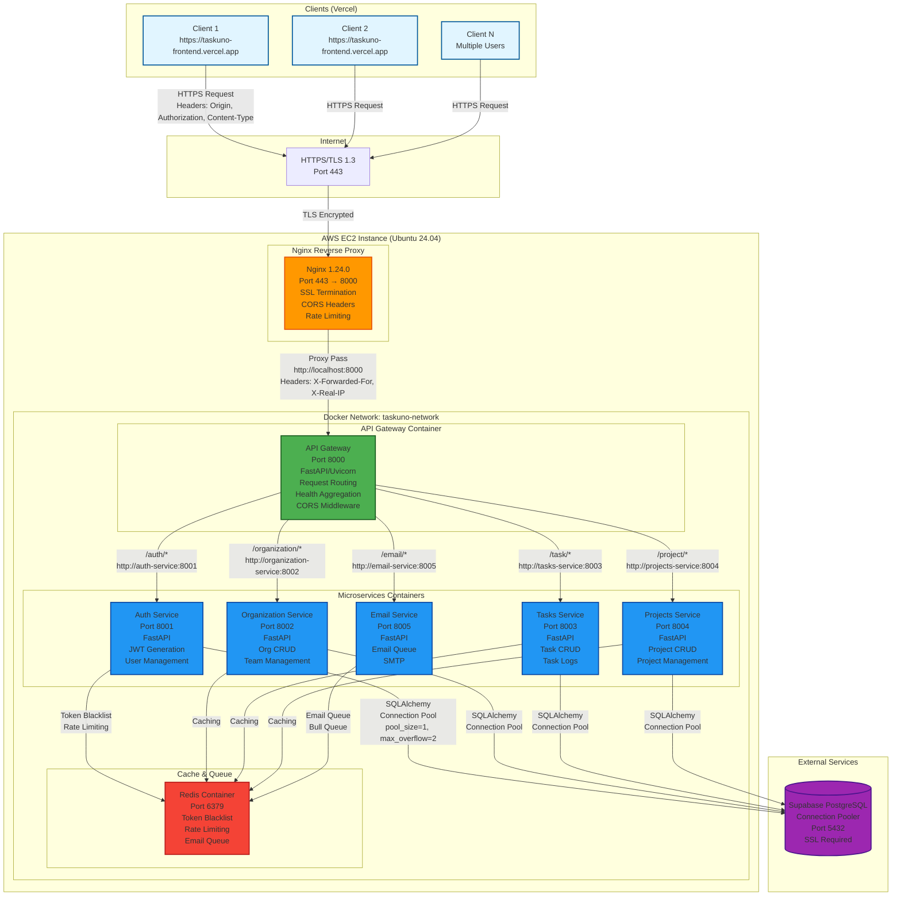

# TaskUno Architecture Diagram

## Mermaid Diagram



## Request Flow with Headers

### 1. Client Request
```
POST https://task-uno.duckdns.org/auth/login
Headers:
  Origin: https://taskuno-frontend.vercel.app
  Content-Type: application/json
  Accept: application/json
  Authorization: Bearer <token> (if authenticated)
  Cookie: access_token=<token>; refresh_token=<token>
```

### 2. Nginx Processing
```
- Receives HTTPS request on port 443
- Terminates SSL/TLS
- Validates CORS origin
- Applies rate limiting rules
- Adds headers:
  X-Forwarded-For: <client-ip>
  X-Real-IP: <client-ip>
  X-Forwarded-Proto: https
- Proxies to: http://localhost:8000 (API Gateway)
```

### 3. API Gateway Processing
```
- Receives request from Nginx
- Determines target service based on path:
  /auth/* → auth-service:8001
  /organization/* → organization-service:8002
  /task/* → tasks-service:8003
  /project/* → projects-service:8004
  /email/* → email-service:8005
- Forwards full path to service
- Aggregates health checks
- Applies CORS middleware
- Returns response to Nginx
```

### 4. Service Processing (Example: Auth Service)
```
- Receives request from API Gateway
- Validates JWT token (if required)
- Checks Redis for token blacklist
- Queries Supabase database
- Generates new JWT tokens
- Returns response to API Gateway
```

### 5. Response Flow
```
Service → API Gateway → Nginx → Client
Headers:
  Access-Control-Allow-Origin: https://taskuno-frontend.vercel.app
  Access-Control-Allow-Credentials: true
  Content-Type: application/json
  X-Gateway: api-gateway
  X-Process-Time: <ms>
```

## Network Architecture

### Docker Network: taskuno-network
- Type: Bridge network
- Services communicate using container names
- Internal DNS resolution
- Isolated from host network

### Port Mapping
- External: 443 (HTTPS) → Nginx
- Internal Docker: 
  - 8000: API Gateway
  - 8001: Auth Service
  - 8002: Organization Service
  - 8003: Tasks Service
  - 8004: Projects Service
  - 8005: Email Service
  - 6379: Redis

### Security
- HTTPS/TLS encryption (Let's Encrypt)
- CORS protection
- Rate limiting (Nginx + Redis)
- JWT token authentication
- Token blacklisting (Redis)
- SQL injection protection (SQLAlchemy ORM)
- Connection pooling (Supabase)

## Technology Stack

### Frontend (Vercel)
- React + TypeScript
- Axios (HTTP client)
- React Router
- Redux Toolkit

### Backend (EC2)
- FastAPI (Python 3.11)
- Uvicorn (ASGI server)
- Docker + Docker Compose
- Nginx (Reverse proxy)
- Redis (Cache & Queue)

### Database
- Supabase (PostgreSQL)
- Connection pooling
- SSL required

### Infrastructure
- AWS EC2 (Ubuntu 24.04)
- Docker containers
- Nginx reverse proxy
- Let's Encrypt SSL
- GitHub Actions CI/CD


